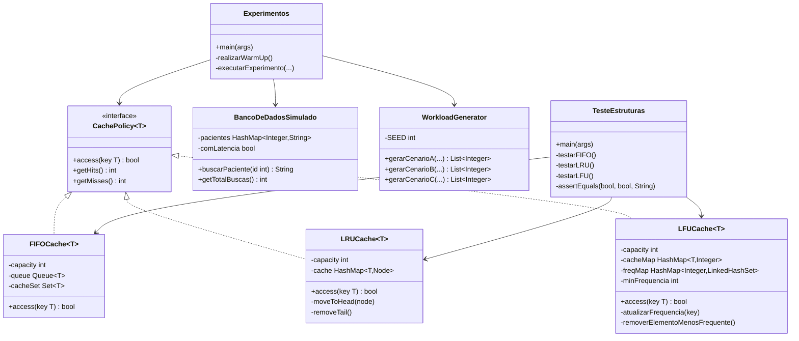

## Avaliação de Políticas de Cache em Sistemas de Saúde
## **FIFO · LFU · LRU — Simulador de Atendimento Ambulatorial em Java** 
## **Disciplina: Laboratório de Estrutura de Dados e Algoritmos (LEDA)**<br>

### **Integrantes:**
- Bruna Rocha Cavalcanti
- Deborah dos Santos Araujo
- Mikael Renan de Oliveira
- Teones Alex Lira de Farias Filho

### Documento do projeto:<br>
https://docs.google.com/document/d/1kaUEZov6HEL2luhc6fQw7EsyArWNKysm/edit?usp=sharing&ouid=106442824714548305124&rtpof=true&sd=true

### Relatório do projeto:<br>
https://docs.google.com/document/d/1lyrMzJ-55yJK_MlIjvBD38Hob6t6xC7bt41ayEYId-4/edit?usp=sharing

---
## 1. Visão Geral
Este projeto implementa e compara três políticas de substituição de cache — FIFO, LRU e LFU — aplicadas a um simulador de sistema de saúde ambulatorial. O objetivo é demonstrar como a escolha da estrutura de dados impacta diretamente o desempenho de um sistema real que acessa prontuários de pacientes.

O simulador processa sequências de acessos a prontuários e coleta quatro métricas por experimento:
- **Hits** — acessos atendidos diretamente pelo cache (rápido, sem I/O)
- **Misses** — acessos que exigiram consulta ao banco de dados (custoso)
- **Tempo de CPU** — custo real das estruturas de dados em nanossegundos
- **Latência simulada** — custo total estimado de I/O: `hits × 1 ms + misses × 10 ms`
---

## 2. Estrutura do Projeto
```
cache-policies-analysis/
├── gerar_graficos.py                          — Script Python para gerar os gráficos PNG
├── resultados_experimentos.csv                — Saída dos experimentos Java
├── graficos/
│   ├── grafico_hit_rate_cenario_a.png         — Gráfico: hit rate Cenário A
│   ├── grafico_hit_rate_cenario_b.png         — Gráfico: hit rate Cenário B
│   ├── grafico_hit_rate_cenario_c.png         — Gráfico: hit rate Cenário C
│   └── grafico_tempo_cpu.png                  — Gráfico: comprovação O(1)
└── src/main/java/br/com/cacheanalysis/
    ├── cache/
    │   ├── CachePolicy.java          — Interface genérica (contrato das políticas)
    │   ├── FIFOCache.java            — Implementação First-In, First-Out
    │   ├── LFUCache.java             — Implementação Least Frequently Used
    │   └── LRUCache.java             — Implementação Least Recently Used
    ├── simulacao/
    │   ├── BancoDeDadosSimulado.java — Mock do banco com latência opcional
    │   ├── WorkloadGenerator.java    — Gerador dos três cenários de acesso
    │   └── Experimentos.java         — Classe principal: warm-up, execução e CSV
    └── testes/
        └── TesteEstruturas.java      — Suíte de testes unitários das políticas
```
---
## 3. Interface `CachePolicy<T>`
Define o contrato implementado pelas três políticas. O uso de generics permite que a interface aceite qualquer tipo de chave, tornando o simulador reutilizável além do contexto de IDs inteiros.

```java
public interface CachePolicy<T> {
    boolean access(T key); // true = HIT, false = MISS
    int getHits();
    int getMisses();
}
```

| Método | Descrição |
|--------|-----------|
| `access(key)` |Tenta acessar uma chave. Retorna true (HIT) se já estava em cache, false (MISS) caso contrário |
| `getHits()` | Contador acumulado de acertos |
| `getMisses()` | Contador acumulado de falhas |

---
## 4. `FIFOCache` — First In, First Out
O item que entrou primeiro é o primeiro a ser removido quando o cache está cheio. Estratégia simples, sem considerar frequência ou recência de acesso.

### Estruturas internas
| Estrutura | Tipo Java | Finalidade |
|-----------|-----------|------------|
| `queue` | `Queue<T>` (LinkedList) | Mantém a ordem cronológica de chegada |
| `cacheSet` | `Set<T>` (HashSet) |Verifica presença em O(1); inicializado com capacity e load factor 1.0f para evitar rehashing |

### Fluxo de `access(key)`
- **HIT:** cacheSet.contains(key) retorna true → incrementa hits → retorna true.
- **MISS:** incrementa misses. Se queue.size() >= capacity, queue.poll() remove o mais antigo e cacheSet.remove() o exclui. O novo item é inserido com queue.offer() e cacheSet.add().

### Complexidade
| Operação | Complexidade | Motivo |
|----------|-------------|--------|
| Verificar presença (HIT) | O(1) | `HashSet.contains()` |
| Inserção / Evicção | O(1) | `LinkedList.offer()` e `poll()` |

---
## 5. `LRUCache` — Least Recently Used
Descarta o item que não é acessado há mais tempo. Ideal para sistemas com localidade temporal, como retornos frequentes de pacientes em curto intervalo.

### Estruturas internas

| Estrutura | Tipo Java | Finalidade |
|-----------|-----------|------------|
| `cache` | `HashMap<T, Node<T>>` | Localiza qualquer nó em O(1) pelo valor da chave |
| Lista duplamente encadeada | `Node<T>` (customizada) |  customizadaMantém a ordem de recência; nós sentinela head e tail eliminam verificações de borda |

Os itens reais ficam entre os sentinelas: o mais recente logo após head, o mais antigo logo antes de tail. 

### Fluxo de `access(key)`

**HIT:** localiza o nó via `HashMap` → `moveToHead(node)` reposiciona em O(1) trocando ponteiros → retorna `true`.

**MISS:** se `cache.size() >= capacity`, `removeTail()` apaga o nó imediatamente antes de `tail` e o remove do `HashMap`. Um novo nó é criado e inserido em `head` → retorna `false`.

### Complexidade

| Operação | Complexidade | Motivo |
|---|---|---|
| Verificar presença (HIT) | O(1) | `HashMap.get()` |
| Mover para o topo | O(1) | Troca de ponteiros na lista encadeada |
| Inserção / Evicção | O(1) | Acesso direto pelo nó sentinela `tail` |

---
## 6. `LFUCache` — Least Frequently Used

Descarta o item menos acessado historicamente. Em empate de frequência, remove o mais antigo (FIFO dentro da mesma frequência). Ideal para sistemas com pacientes crônicos de alta recorrência.

### Estruturas internas

| Estrutura | Tipo Java | Finalidade |
|---|---|---|
| `cacheMap` | `HashMap<T, Integer>` | Mapeia cada chave à sua frequência atual; inicializado com `load factor 1.0f` para evitar rehashing |
| `freqMap` | `HashMap<Integer, LinkedHashSet<T>>` | Mapeia cada frequência ao conjunto de chaves com aquela frequência, preservando ordem de inserção para tiebreak FIFO |
| `minFrequencia` | `int` | Sentinela que aponta para a menor frequência ativa, permitindo evicção em O(1) sem busca linear |

### Fluxo de `access(key)`

**HIT:** chama `atualizarFrequencia(key)` — move a chave do bucket atual para o bucket `freq+1` em `freqMap`; se o bucket ficou vazio, remove-o e avança `minFrequencia` se necessário.

**MISS:** se cheio, chama `removerElementoMenosFrequente()` — obtém o bucket de `minFrequencia` e remove o primeiro elemento do `LinkedHashSet` (o mais antigo com menor frequência). Insere nova chave com frequência 1 e define `minFrequencia = 1`.

### Complexidade

| Operação | Complexidade | Motivo |
|---|---|---|
| Verificar presença (HIT) | O(1) | `HashMap.containsKey()` |
| Incrementar frequência | O(1) | `HashMap` + `LinkedHashSet` |
| Evicção | O(1) | `minFrequencia` aponta diretamente para o bucket alvo |

---
## 7. `WorkloadGenerator` — Gerador de Cenários

Gera as sequências de IDs de pacientes usadas nos experimentos. A **seed fixa (42)** garante reprodutibilidade total — toda execução produz exatamente a mesma sequência. Todos os `ArrayList` são inicializados com `new ArrayList<>(totalAcessos)` para evitar realocações durante a geração.

### Cenário A — Acesso Aleatório Uniforme (Baseline)

Todos os pacientes têm igual probabilidade de ser acessados. Sem padrão de repetição, representa o pior caso para caches e serve como base de comparação entre as políticas.

```java
acessos.add(random.nextInt(totalPacientes) + 1);
```

### Cenário B — Localidade Temporal (LRU-Friendly)

Simula pacientes que retornam ao posto em curto intervalo, criando localidade temporal. A janela deslizante é implementada como um **buffer circular** com array primitivo `int[10]`, eliminando qualquer alocação de memória ou deslocamento de elementos.

```
- 80% de chance: reutiliza paciente da janela dos 10 mais recentes — O(1) puro
- 20% de chance: acessa paciente novo aleatório
```

O ponteiro `indiceInsercao` avança com `(indiceInsercao + 1) % 10`, sobrescrevendo circularmente o elemento mais antigo sem nenhuma alocação adicional. Favorece o **LRU**.

### Cenário C — Frequência / Pareto (LFU-Friendly)

Aplica viés estatístico inspirado na regra 80/20. O corte de crônicos é calculado com `Math.max(1, totalPacientes / 5)` para garantir que nunca seja zero independentemente do tamanho da base.

```
- 70% dos acessos nos primeiros 20% dos IDs (pacientes crônicos)
- 30% restantes: qualquer paciente no universo completo
```
Favorece o **LFU**.

### Resumo dos cenários

| Cenário | Padrão de Acesso | Política Favorecida |
|---|---|---|
| A — Uniforme | Todos os pacientes com igual probabilidade | Nenhuma (baseline) |
| B — Temporalidade | 80% repetem pacientes recentes (buffer circular) | LRU |
| C — Pareto | 70% concentrados em 20% dos pacientes | LFU |

---

## 8. `BancoDeDadosSimulado`

Simula um banco de dados com registros de prontuários. Oferece dois modos:

- **Com latência** (`comLatencia = true`): aplica `Thread.sleep(1)` por acesso, representando custo de I/O em disco. Para demonstrações em pequena escala.
- **Sem latência** (`comLatencia = false`, padrão): modo rápido para experimentos de larga escala, onde o sleep distorceria a medição de CPU.

Em `Experimentos.java`, o banco é sempre instanciado sem latência. A latência de I/O é calculada matematicamente ao final: `hits × 1 ms + misses × 10 ms`.

---
## 9. `Experimentos` — Classe Principal

Coordena todos os testes, salva os resultados em CSV e inclui **warm-up de JVM** para garantir medições de tempo confiáveis.

### Warm-up da JVM

Antes de qualquer medição, `realizarWarmUp()` executa 25.000 acessos descartáveis em cada política, forçando o compilador JIT a otimizar o código antes dos experimentos reais.

```java
private static void realizarWarmUp() {
    int iteracoes = 25000;
    CachePolicy<Integer> lru = new LRUCache<>(1000);
    CachePolicy<Integer> lfu = new LFUCache<>(1000);
    CachePolicy<Integer> fifo = new FIFOCache<>(1000);
    for (int i = 0; i < iteracoes; i++) {
        int key = i % 2000;
        lru.access(key); lfu.access(key); fifo.access(key);
    }
}
```

### Configurações testadas

| Parâmetro | Valores |
|---|---|
| Bases de pacientes | 1.000 / 10.000 / 50.000 |
| Total de acessos | base × 5 |
| Capacidades de cache | 10, 50, 100, 500, 1.000, 5.000, 10.000, 50.000 |

### Colunas do CSV de saída

| Coluna | Descrição |
|---|---|
| `Cenario` | A, B ou C |
| `BasePacientes` | Tamanho do banco simulado |
| `TotalAcessos` | Número total de requisições processadas |
| `Capacidade` | Slots disponíveis no cache |
| `Politica` | FIFO, LFU ou LRU |
| `Hits` / `Misses` | Contadores de acerto e falha |
| `AcessosBanco` | Consultas ao banco via `bancoLocal.getTotalBuscas()` |
| `TempoTotal_ns` | Tempo real de CPU sem latência artificial (pós warm-up) |
| `LatenciaSimulada_ms` | Custo estimado: `hits × 1 ms + misses × 10 ms` |

---
## 10. `TesteEstruturas` — Testes Unitários

A classe `TesteEstruturas` é uma suíte de testes sem dependências externas que valida o comportamento de evicção de cada política com cenários determinísticos. Os testes usam um método utilitário `assertEquals(boolean, boolean, String)` próprio, que lança `AssertionError` com mensagem descritiva em caso de falha, interrompendo a execução imediatamente com código de saída 1.

### Teste FIFO

```
Inserção: [1, 2, 3] → capacidade máxima atingida
Acesso a 4 → evicta o elemento 1 (mais antigo)
Estado esperado: [2, 3, 4]
```

Verifica que 2, 3 e 4 geram HIT, e que 1 gera MISS (foi evictado).

### Teste LRU

```
Inserção: [1, 2, 3]
Acesso a 1 → torna 1 o mais recentemente usado
Acesso a 4 → evicta o elemento 2 (menos recentemente usado)
Estado esperado: [3, 1, 4]
```

Verifica que 1, 3 e 4 geram HIT, e que 2 gera MISS (evictado por ser o LRU).

### Teste LFU

```
Inserção: 1 acessado 2×(freq 2), 2 acessado 1× (freq 1), 3 acessado 1× (freq 1)
Acesso a 4 → empate entre 2 e 3 (freq 1); evicta 2 por ser mais antigo (tiebreak FIFO)
Estado esperado: [1, 3, 4]
```

Verifica que 3, 1 e 4 geram HIT, e que 2 gera MISS (evictado pelo critério de desempate temporal).

### Como executar os testes

```bash
java -cp bin br.com.cacheanalysis.testes.TesteEstruturas
```

Saída esperada em caso de sucesso:

```
Iniciando execução da suíte de testes unitários...

✅ FIFOCache: Comportamento de evicção validado com sucesso.
✅ LRUCache: Comportamento de evicção validado com sucesso.
✅ LFUCache: Comportamento de evicção validado com sucesso.

✅ Todos os testes unitários foram concluídos sem erros. As estruturas operam conforme as especificações.
```
---
## 11. `gerar_graficos.py` — Visualização dos Resultados

Script Python que lê o CSV gerado pelo Java e produz 4 gráficos PNG usando `pandas` e `matplotlib`. Todos os gráficos são filtrados para a base de 50.000 pacientes (maior escala).

| Arquivo gerado | Conteúdo |
|---|---|
| `graficos/grafico_tempo_cpu.png` | Tempo de CPU por acesso (ns) × capacidade — comprovação visual do O(1) |
| `graficos/grafico_hit_rate_cenario_a.png` | Hit rate (%) × capacidade — Cenário A (Uniforme) |
| `graficos/grafico_hit_rate_cenario_b.png` | Hit rate (%) × capacidade — Cenário B (Temporal) |
| `graficos/grafico_hit_rate_cenario_c.png` | Hit rate (%) × capacidade — Cenário C (Pareto) |

```bash
pip install pandas matplotlib
python gerar_graficos.py
```
---

## 12. Análise de Complexidade Assintótica

| Política | Estrutura Principal | Busca (HIT) | Inserção / Evicção |
|---|---|---|---|
| **FIFO** | `Queue` + `HashSet` (load factor 1.0) | O(1) | O(1) |
| **LRU** | `HashMap` + Lista Duplamente Encadeada | O(1) | O(1) |
| **LFU** | Duplo `HashMap` (load factor 1.0) + `LinkedHashSet` | O(1) | O(1) |

Todas as três políticas atingem O(1) em todas as operações. O LFU alcança O(1) na evicção porque `minFrequencia` aponta diretamente para o bucket de menor frequência, eliminando qualquer busca linear.

## 13. Diagrama de Classes




---

## 14. Como Compilar e Executar

**Passo 1 — Compilação** (na raiz do projeto):
```bash
javac -d bin $(find src/main/java -name "*.java")
```

**Passo 2 — Testes unitários** (recomendado antes dos experimentos):
```bash
java -cp bin br.com.cacheanalysis.testes.TesteEstruturas
```

**Passo 3 — Experimentos:**
```bash
java -cp bin br.com.cacheanalysis.simulacao.Experimentos
```

O programa exibirá o progresso do warm-up e dos experimentos no console e gravará `resultados_experimentos.csv` ao final.

**Passo 4 — Gráficos** (requer Python):
```bash
pip install pandas matplotlib
python gerar_graficos.py
```
---
## 15. Conclusão

A execução do simulador em escala de estresse demonstra que a eficiência de um sistema de saúde não depende apenas de hardware, mas da escolha estratégica das estruturas de dados.

**FIFO** oferece simplicidade máxima e complexidade O(1), mas ignora padrões de acesso — seu desempenho não se adapta ao comportamento dos dados.

**LRU** é ideal quando há localidade temporal: pacientes que retornam frequentemente em curto prazo ficam quentes no cache. Implementado com `HashMap` + lista duplamente encadeada para garantir O(1) em todas as operações.

**LFU** é ideal quando há concentração de acesso: pacientes crônicos acumulam alta frequência e raramente são evictados. O uso de `minFrequencia` como sentinela garante evicção em O(1) sem buscas lineares.

Não existe política universalmente superior. A escolha depende do padrão de acessos da unidade de saúde: sistemas com forte localidade temporal favorecem LRU; sistemas com concentração em pacientes recorrentes favorecem LFU; ambientes sem padrão definido podem optar pela simplicidade do FIFO.
