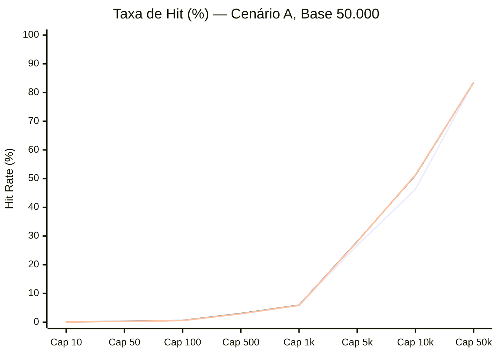
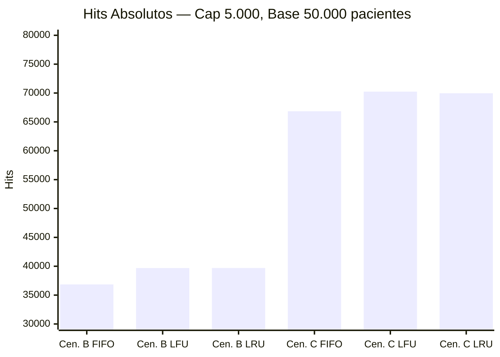
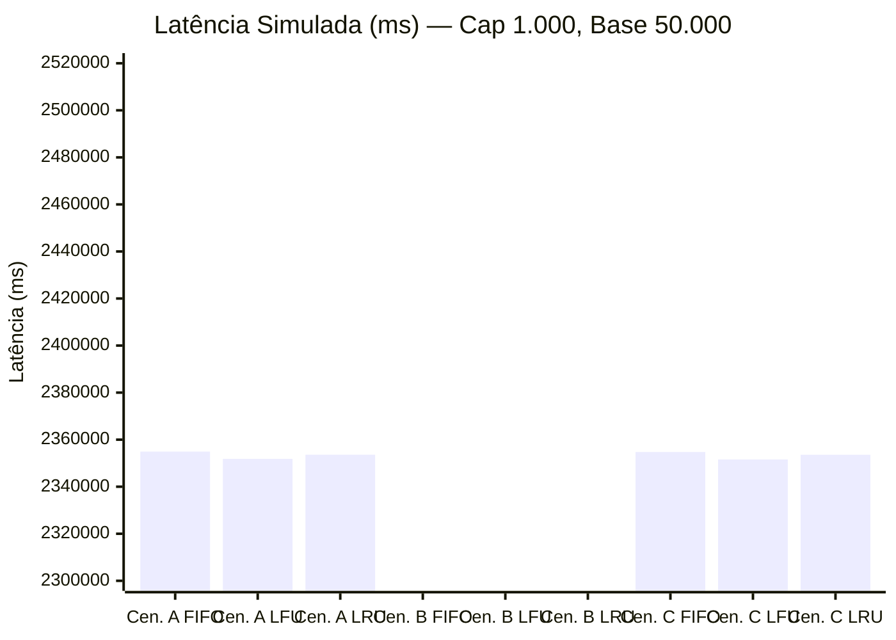
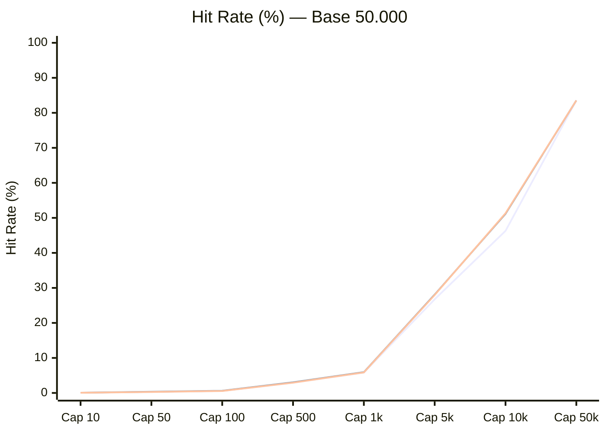
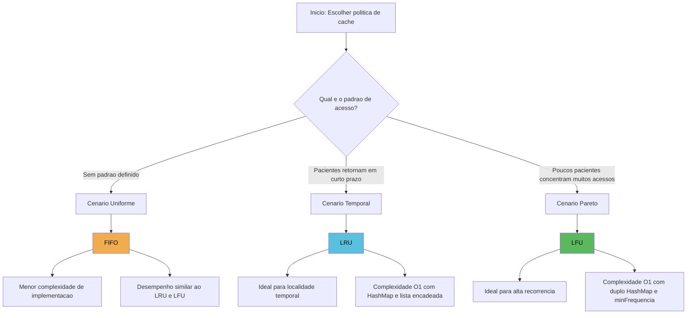
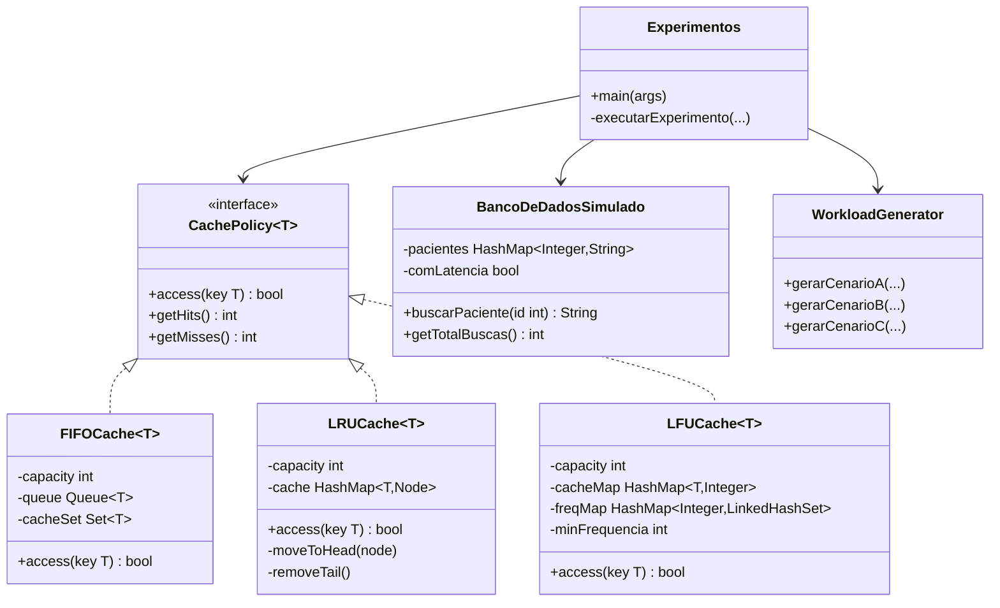

## Avaliação de Políticas de Cache em Sistemas de Saúde
## **FIFO · LFU · LRU — Simulador de Atendimento Ambulatorial em Java** 
## **Disciplina: Laboratório de Estrutura de Dados e Algoritmos (LEDA)**<br>

### **Integrantes:**
- Bruna Rocha Cavalcanti
- Deborah dos Santos Araujo
- Mikael Renan de Oliveira
- Teones Alex Lira de Farias Filho

### **Documento do projeto:**<br>
https://docs.google.com/document/d/1kaUEZov6HEL2luhc6fQw7EsyArWNKysm/edit?usp=sharing&ouid=106442824714548305124&rtpof=true&sd=true

---
## 1. Visão Geral
Este projeto implementa e compara três políticas de substituição de cache aplicadas a um simulador de sistema de saúde. O objetivo é demonstrar como a escolha da estrutura de dados impacta diretamente o desempenho de um sistema real.

O simulador processa sequências de acessos a prontuários de pacientes e mede quatro métricas principais:
- **Hits** — acessos atendidos diretamente pelo cache (rápido, sem I/O)
- **Misses** — acessos que exigiram consulta ao banco de dados (custoso)
- **Tempo de CPU** — custo real das estruturas de dados em nanossegundos
- **Latência simulada** — custo total estimado de I/O: `hits × 1 ms + misses × 10 ms`
---

## 2. Estrutura do Projeto
```
"cache-policies-analysis
└── src/main/java/br/com/cacheanalysis/
    ├── cache/
    │   ├── CachePolicy.java          — Interface genérica (contrato das políticas)
    │   ├── FIFOCache.java            — Implementação First In, First Out
    │   ├── LFUCache.java             — Implementação Least Frequently Used
    │   └── LRUCache.java             — Implementação Least Recently Used
    └── simulacao/
        ├── BancoDeDadosSimulado.java — Mock do banco de dados com latência opcional
        ├── WorkloadGenerator.java    — Gerador dos três cenários de acesso
        └── Experimentos.java         — Classe principal: executa testes e salva CSV
```

---
## 3. Interface `CachePolicy<T>`
Define o contrato que todas as políticas devem implementar. Usa generics para aceitar qualquer tipo de chave.

```java
public interface CachePolicy<T> {
    boolean access(T key); // true = HIT, false = MISS
    int getHits();
    int getMisses();
}
```

| Método | Descrição |
|--------|-----------|
| `access(key)` | Tenta acessar uma chave. Retorna `true` se já estava em cache (HIT) ou `false` se não estava (MISS) |
| `getHits()` | Contador acumulado de acertos |
| `getMisses()` | Contador acumulado de falhas |

---
## 4. `FIFOCache` — First In, First Out
O item que entrou primeiro é o primeiro a sair quando o cache está cheio. Estratégia simples, sem considerar frequência ou recência de acesso.

### Estruturas internas
| Estrutura | Tipo Java | Finalidade |
|-----------|-----------|------------|
| `queue` | `Queue<T>` (LinkedList) | Mantém a ordem cronológica de chegada |
| `cacheSet` | `Set<T>` (HashSet) | Verifica a presença de um item em O(1) |

### Fluxo de `access(key)`
**HIT:** `cacheSet.contains(key)` retorna `true` → incrementa `hits` → retorna `true`.

**MISS:** incrementa `misses`. Se o cache estiver cheio, `queue.poll()` remove o item mais antigo e `cacheSet.remove()` o exclui do conjunto. Em seguida, o novo item é inserido com `queue.offer()` e `cacheSet.add()`.

### Complexidade
| Operação | Complexidade | Motivo |
|----------|-------------|--------|
| Verificar presença (HIT) | O(1) | `HashSet.contains()` |
| Inserção / Evicção | O(1) | `LinkedList.offer()` e `poll()` |

---
## 5. `LRUCache` — Least Recently Used
Descarta o item que não é acessado há mais tempo. É o mais indicado para sistemas com localidade temporal, como retornos frequentes de pacientes em curto intervalo.

### Estruturas internas

| Estrutura | Tipo Java | Finalidade |
|-----------|-----------|------------|
| `cache` | `HashMap<T, Node<T>>` | Localiza qualquer nó em O(1) pelo valor da chave |
| Lista duplamente encadeada | `Node<T>` (customizada) | Mantém a ordem de recência com dois nós sentinela (`head` e `tail`) |

A lista possui dois nós fantasmas fixos (`head` e `tail`). Os itens reais ficam entre eles: o mais recente fica logo após `head`, e o mais antigo fica logo antes de `tail`.

### Fluxo de `access(key)`

**HIT:** localiza o nó via `HashMap` → `moveToHead(node)` reposiciona o nó em O(1) trocando ponteiros → retorna `true`.

**MISS:** se o cache estiver cheio, `removeTail()` remove o nó imediatamente antes de `tail` e o apaga do `HashMap`. Em seguida, um novo nó é criado e adicionado à `head` → retorna `false`.

### Complexidade
| Operação | Complexidade | Motivo |
|----------|-------------|--------|
| Verificar presença (HIT) | O(1) | `HashMap.get()` |
| Mover para o topo | O(1) | Troca de ponteiros na lista encadeada |
| Inserção / Evicção | O(1) | Acesso direto pelo nó sentinela `tail` |

---

## 6. `LFUCache` — Least Frequently Used
Descarta o item que foi acessado o menor número de vezes. Em caso de empate de frequência, remove o mais antigo (FIFO dentro da mesma frequência). É o mais indicado para sistemas com pacientes crônicos acessados repetidamente.

### Estruturas internas
| Estrutura | Tipo Java | Finalidade |
|-----------|-----------|------------|
| `cacheMap` | `HashMap<T, Integer>` | Mapeia cada chave à sua frequência atual |
| `freqMap` | `HashMap<Integer, LinkedHashSet<T>>` | Mapeia cada frequência ao conjunto de chaves com aquela frequência, preservando ordem de inserção |
| `minFrequencia` | `int` | Sentinela que rastreia a menor frequência ativa, evitando buscas lineares |

### Fluxo de `access(key)`
**HIT:** busca a frequência atual em `cacheMap` → remove a chave do conjunto da frequência atual em `freqMap` → se esse conjunto ficou vazio, remove o bucket do mapa e, se era o mínimo, incrementa `minFrequencia` → insere a chave no conjunto da frequência + 1.

**MISS:** se o cache estiver cheio, obtém o `LinkedHashSet` de `minFrequencia` e remove o primeiro elemento (mais antigo com menor frequência). Em seguida, insere a nova chave com frequência 1 e define `minFrequencia = 1`.

### Complexidade
| Operação | Complexidade | Motivo |
|----------|-------------|--------|
| Verificar presença (HIT) | O(1) | `HashMap.containsKey()` |
| Incrementar frequência | O(1) | `HashMap` + `LinkedHashSet` |
| Evicção (MISS com cache cheio) | O(1) | `minFrequencia` aponta diretamente para o conjunto alvo |

---
## 7. `WorkloadGenerator` — Gerador de Cenários
Gera as sequências de IDs de pacientes processadas nos experimentos. A **SEED fixa (42)** garante que cada execução produza exatamente os mesmos dados, tornando os experimentos reproduzíveis.

### Cenário A — Acesso Aleatório Uniforme (Baseline)
Todos os pacientes têm a mesma probabilidade de serem acessados. Sem padrão de repetição significativo, serve como base de comparação entre as políticas.

```java
int id = random.nextInt(totalPacientes) + 1;
```

### Cenário B — Temporalidade (LRU Friendly)
Simula pacientes que retornam ao posto em curto intervalo de tempo, criando localidade temporal. Uma janela deslizante (tamanho 10) rastreia os pacientes recentemente acessados:
- **80%** de chance de repetir um paciente da janela recente
- **20%** de chance de acessar um paciente novo

A janela deslizante é implementada com `ArrayList` de tamanho fixo (máx. 10 elementos). O acesso por índice é O(1) sem alocação, e o `remove(0)` custa no máximo O(10) — custo fixo e irrelevante na prática. Favorece o **LRU**.

### Cenário C — Frequência / Regra de Pareto (LFU Friendly)
Aplica viés estatístico: 20% dos pacientes (casos crônicos) concentram 70% dos acessos.
- **70%** dos acessos vão para o grupo dos primeiros 20% de IDs (pacientes crônicos)
- **30%** restantes acessam qualquer paciente aleatoriamente

Favorece o **LFU**.

### Resumo dos cenários
| Cenário | Padrão de Acesso | Política Favorecida |
|---------|-----------------|---------------------|
| A — Uniforme | Todos os pacientes com igual probabilidade | Nenhuma (baseline) |
| B — Temporalidade | 80% repetem pacientes recentes | LRU |
| C — Frequência (Pareto) | 70% concentrados em 20% dos pacientes | LFU |
---

## 8. `BancoDeDadosSimulado`
Simula um banco de dados com registros de prontuários. Oferece dois modos de operação:
- **Com latência** (`comLatencia = true`): aplica `Thread.sleep(1)` por acesso, representando o custo de I/O em disco. Indicado para demonstrações em pequena escala.
- **Sem latência** (`comLatencia = false`, padrão): modo rápido para experimentos de larga escala, onde o sleep distorceria a medição de CPU.

```java
public String buscarPaciente(int id) {
    totalBuscas++;
    if (comLatencia) {
        try {
            Thread.sleep(1); // simula latência de disco
        } catch (InterruptedException e) {
            Thread.currentThread().interrupt();
        }
    }
    return pacientes.get(id);
}
```

> **Sobre a medição de tempo:** em `Experimentos.java`, o banco é instanciado com `comLatencia = false`. O `Thread.sleep` não é executado, portanto não distorce o `TempoTotal_ns`. Nos misses, o banco é consultado via `buscarPaciente(id)` e contabiliza os acessos reais em `getTotalBuscas()`. A latência de I/O é calculada matematicamente ao final de cada experimento (`hits × 1 ms + misses × 10 ms`).

---
## 9. `Experimentos` — Classe Principal
Coordena todos os testes e salva os resultados em CSV. Para cada combinação de **cenário × base de pacientes × capacidade**, as três políticas são testadas com a mesma sequência de acessos.

### Configurações testadas
| Parâmetro | Valores |
|-----------|---------|
| Bases de pacientes | 1.000 / 10.000 / 50.000 |
| Total de acessos | base × 5 |
| Capacidades de cache | 10, 50, 100, 500, 1.000, 5.000, 10.000, 50.000 |

### Colunas do CSV de saída
| Coluna | Descrição |
|--------|-----------|
| `Cenario` | A, B ou C |
| `BasePacientes` | Tamanho do banco de dados simulado |
| `TotalAcessos` | Número total de requisições processadas |
| `Capacidade` | Slots disponíveis no cache |
| `Politica` | FIFO, LFU ou LRU |
| `Hits` / `Misses` | Contadores de acerto e falha |
| `AcessosBanco` | Número de consultas efetivas ao banco, contabilizadas via `bancoLocal.getTotalBuscas()` |
| `TempoTotal_ns` | Tempo real de CPU sem latência artificial |
| `LatenciaSimulada_ms` | Custo estimado de I/O: `hits×1ms + misses×10ms` |

### Fluxo de `executarExperimento`
1. Itera sobre todos os IDs da sequência: chama `cache.access(id)`; se MISS, consulta `bancoLocal.buscarPaciente(id)`
2. Cronometra o bloco com `System.nanoTime()` (banco instanciado sem `Thread.sleep`)
3. Coleta `acessosBanco = bancoLocal.getTotalBuscas()`
4. Calcula `latenciaSimulada = hits × 1ms + misses × 10ms`
5. Imprime o resultado no console e grava a linha no CSV

---

## 10. Análise de Complexidade Assintótica
| Política | Estrutura Principal | Busca (HIT) | Inserção / Evicção |
|----------|--------------------|-----------|--------------------|
| **FIFO** | `Queue` + `HashSet` | O(1) | O(1) |
| **LRU** | `HashMap` + Lista Duplamente Encadeada | O(1) | O(1) |
| **LFU** | Duplo `HashMap` + `LinkedHashSet` | O(1) | O(1) |

> O LFU atinge O(1) na evicção porque a variável `minFrequencia` aponta diretamente para o conjunto de menor frequência, eliminando a necessidade de busca linear.
---

## 11. Resultados dos Experimentos
Os gráficos abaixo foram gerados a partir do arquivo `resultados_experimentos.csv`, com base de 50.000 pacientes (o cenário de maior escala).

### 11.1 Taxa de Hit por Capacidade — Cenário A (Uniforme, base 50k)


> 🔵 1ª linha: FIFO · 🟢 2ª linha: LFU · 🔴 3ª linha: LRU — No cenário uniforme (sem padrão), as três políticas convergem para o mesmo resultado em altas capacidades.

---

### 11.2 Comparação de Hits — Cenário B vs C (Capacidade 5.000, base 50k)


> No **Cenário B** (temporalidade), LRU e LFU se equiparam. No **Cenário C** (Pareto), LFU e LRU superam FIFO por ~5%.

---

### 11.3 Latência Simulada por Política — Capacidade 1.000, base 50k
Fórmula: `hits × 1ms + misses × 10ms`



> Cenário B demonstra ganho expressivo de latência em todas as políticas — a localidade temporal reduz os misses drasticamente.

---

### 11.4 Hit Rate (%) por Política e Capacidade — base 50k

> 🔵 1ª linha: FIFO · 🟢 2ª linha: LFU · 🔴 3ª linha: LRU — LFU e LRU superam FIFO nas capacidades intermediárias (5k–10k).

---

### 11.5 Fluxo de Decisão — Qual política escolher?



---
### 11.6 Diagrama de Classes Simplificado



---

## 12. Como Compilar e Executar
**Passo 1 — Compilação** (na raiz do projeto):
```bash
javac -d bin $(find src/main/java -name "*.java")
```

**Passo 2 — Execução:**
```bash
java -cp bin br.com.cacheanalysis.simulacao.Experimentos
```

O programa testa automaticamente todas as combinações e gera o arquivo `resultados_experimentos.csv` ao final da execução.

---
## 13. Conclusão
A execução do simulador em escala de estresse demonstra que a eficiência de um sistema de saúde não depende apenas de hardware, mas da escolha estratégica das estruturas de dados.

- **FIFO** oferece simplicidade máxima de implementação, mas não aproveita padrões de acesso
- **LRU** é ideal quando há localidade temporal — pacientes que retornam frequentemente em curto prazo
- **LFU** é ideal quando há concentração de acesso — pacientes crônicos com histórico de alta recorrência

Não existe um algoritmo universalmente melhor. A escolha da política depende do padrão de requisições da unidade de saúde, exigindo análise prévia do comportamento dos dados.
